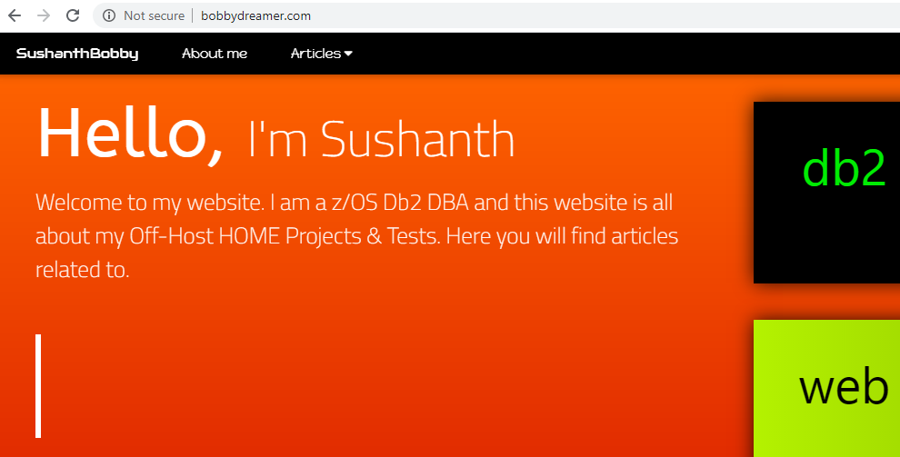
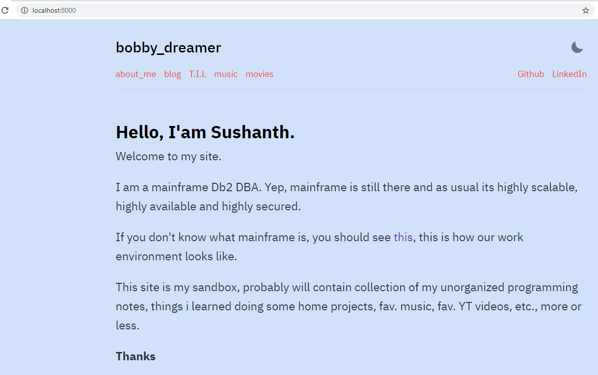
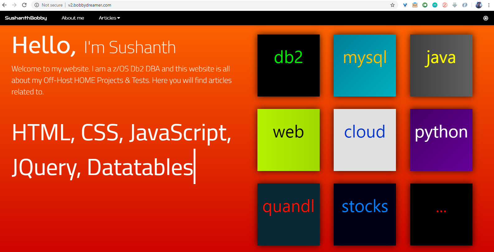
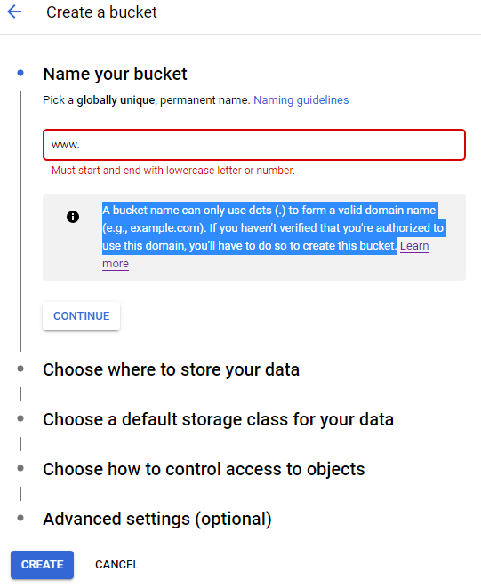
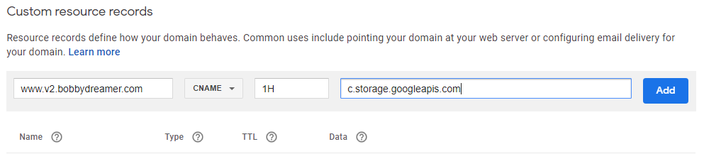

Here i am sort of archiving my old site, so new site would take over. 

**Current site** : bobbydreamer.com 
	

**New Site** : bobbydreamer.com
	

After this process, current site would become archived site and new site becomes current site

**Archived site** : v2.bobbydreamer.com 
	

I am not sure how many people would do this, i sort of like to have all my sites up for reference. 

1. Create a new bucket in GCS with settings multi-regional and permissions `fine-grained` access control.
	

1. Since the current site is hosted from Cloud Storage, i am just moving all the files from current bucket `www.bobbydreamer.com` to `www.v2.bobbydreamer.com`. I don't have to do this but it will reduce confusion in future. Open Cloud Shell and enter the below commands
    ```sh
    gsutil -m cp -r gs://www.bobbydreamer.com/* gs://www.v2.bobbydreamer.com

    gsutil defacl set public-read gs://www.v2.bobbydreamer.com
    ```
    First command `gsutil -m cp -r gs://www.bobbydreamer.com/* gs://www.v2.bobbydreamer.com` copies files from one bucket to another 
    * -m for parallel(multi-threaded/multi-processing) copy
    * -r for recursive to copy entire directory tree 

    Second command `gsutil defacl set public-read gs://www.v2.bobbydreamer.com` to make entire bucket public

1. Did you note the highlighted text in the image in point(1). Sort of, Domain ownership verification required. Since everything is in Planet Google, its easy for me. I am already logged in google account, now i have to go to [Search console](https://search.google.com/search-console), type in new URL( www.v2.bobbydreamer.com ) to verify ownership. 

1. Adding custom resource records in Google Domains. Go to [Google Domains](https://domains.google/intl/en_in/) -> My Domains -> DNS -> Add the below custom record 
	

1. After waiting for 10mins everything is set. 
	

1. As a final step i have deleted the "Custom resource records" related to www.bobbydreamer.com with data "c.storage.googleapis.com"
