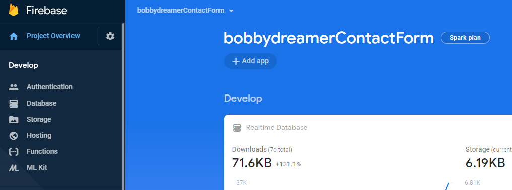
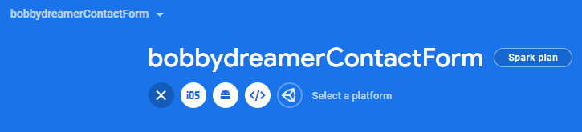
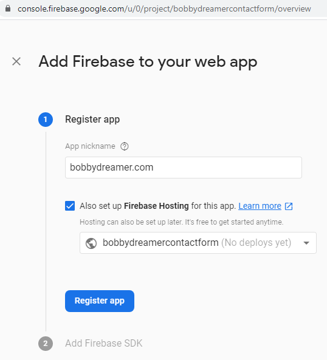
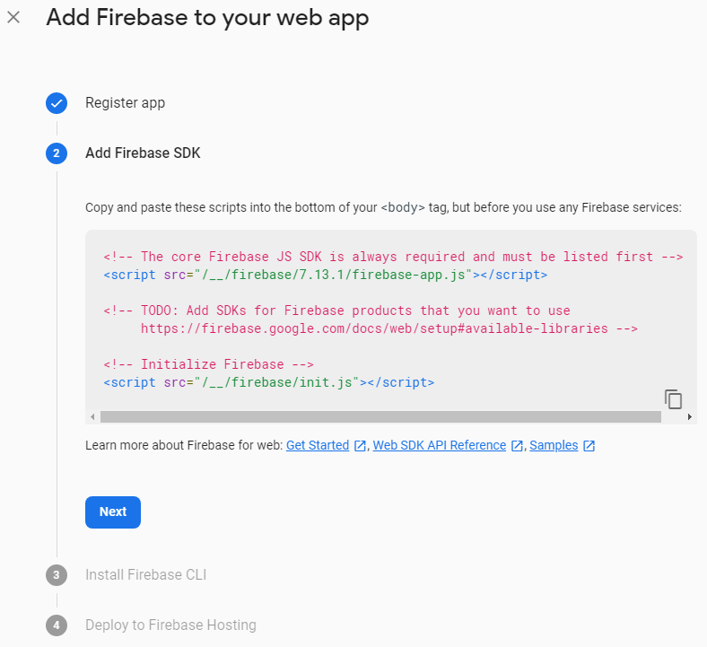

### # Final Testing
#### Deploying the site locally (Pre-PROD / UAT)

**Source** : [Gatsby : Overview of the Gatsby Build Process](https://www.gatsbyjs.org/docs/overview-of-the-gatsby-build-process/)    

##### # Takeaway
* Once the `gatsby build` command completes successfully. All the files thats needed for deployments are available in `public' folder. 
* Test the build using `gatsby serve` command 

So far in the testing phase, we have been using `gatsby develop`, what it did is, run a server in the background, enabling useful features like live reloading and Gatsby’s data explorer(GraphQL). Now, when all the testing is completed, when you are ready to take things to the next level, you do the `gatsby build` what this does is, creates a version of your site with production-ready optimizations like packaging up your site’s config, data, and code, and creating all the static HTML pages that eventually get rehydrated into a React application.

**What happens when you run `gatsby build`?**    

Since Gatsby builds everything ahead of time, this process creates the entire site with all of the data your pages need at once(like minifined files, transformed images, json files). So, when your site is deployed, it doesn’t need to run with server-side processes because everything has been gathered up and compiled by Gatsby and available in `public` folder. 

Output of the `gatsby build`
```sh 

```

Finally you can test the output of the build compilation using `gatsby serve`

If all OK means, UAT is completed means User has Accepted Testing means You have accepted your own testing. Wow. 

### # Hosting
#### Step-by-Step to host in Firebase

**Source** : [Deploying to Firebase Hosting](https://www.gatsbyjs.org/docs/deploying-to-firebase/)

Steps are pretty straight forward as in the above source link,

1. Install nodeJS 

1. Open firebase using Google Account

1. Create a firebase project  ( I already have a firebase project, mostly empty, so i am using that ). Click Project Overview and click Add App
    
1. Click `</>` icon
    
1. Fill in the details, App Nickname, Check Hosting and you have option either create new app or select existing one. I am selecting existing app. Click Register App 
    
1. If you are building a Web Application, you should add this in the site. I am not using this at the moment. So, its not required for me. 
    

1. Install firebase-tools, its needed to host your site with Firebase Hosting.
  ```sh
  npm install -g firebase-tools
  ```

1. After installation, go to the root folder of your site and sign into Firebase using Google account
  ```sh 
  firebase login
  ```

1. Test the CLI using command `firebase projects:list`
  ```sh
  PS D:\BigData\08. HTML\Gatsby\lupin\bdv2> firebase projects:list
  √ Preparing the list of your Firebase projects
  ┌─────────────────────────┬──────────────────────────┬──────────────────────┐
  │ Project Display Name    │ Project ID               │ Resource Location ID │
  ├─────────────────────────┼──────────────────────────┼──────────────────────┤
  │ BTD-IN2-20180718        │ btd-in2-20180718         │ us-central           │
  ├─────────────────────────┼──────────────────────────┼──────────────────────┤
  │ feedbacks               │ feedbacks-9be7f          │ us-central           │
  ├─────────────────────────┼──────────────────────────┼──────────────────────┤
  │ stashit                 │ stashit-7885bob          │ us-central           │
  ├─────────────────────────┼──────────────────────────┼──────────────────────┤
  │ bobbydreamerContactForm │ bobbydreamercontactform  │ us-central           │
  ├─────────────────────────┼──────────────────────────┼──────────────────────┤
  │ API Project - 1         │ api-project-333122123186 │ us-central           │
  └─────────────────────────┴──────────────────────────┴──────────────────────┘

  5 project(s) total.
  ```

1. Run the below command in the root directory of your site to initialize Firebase 
  ```sh 
  firebase init
  ```
1. Make below highlighted updates to `firebase.json` file in the site-directory 
  ```sh 

  ```
1. Build the site, if you haven't using `gatsby build`, this is important as all your static content should be in `public` directory which will be used by firebase hosting. 
1. Finalize the build using `gatsby serve` ( final check ). 
1. Deploy the site to firebase using below command and at the end of deployment you will get the site URL. 
  ```sh 
  firebase deploy 
  ```

#### # Connecting to a custom domain 

**Source** : [Connect a custom domain](https://firebase.google.com/docs/hosting/custom-domain)


### # Resources
1. [Overview of the Gatsby Build Process](https://www.gatsbyjs.org/docs/overview-of-the-gatsby-build-process/)
1. [Deploying to Firebase Hosting](https://www.gatsbyjs.org/docs/deploying-to-firebase/)

### # Related articles
1. [How i made this gatsby site](./how-i-made-this-site)
