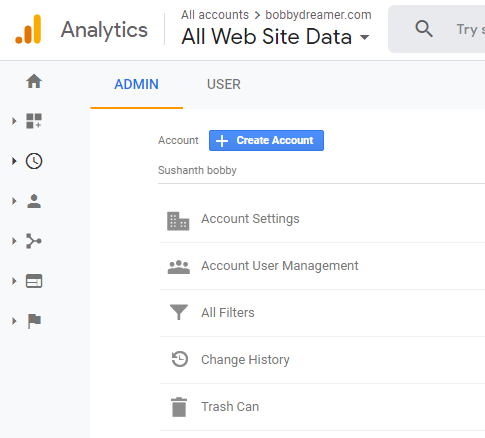
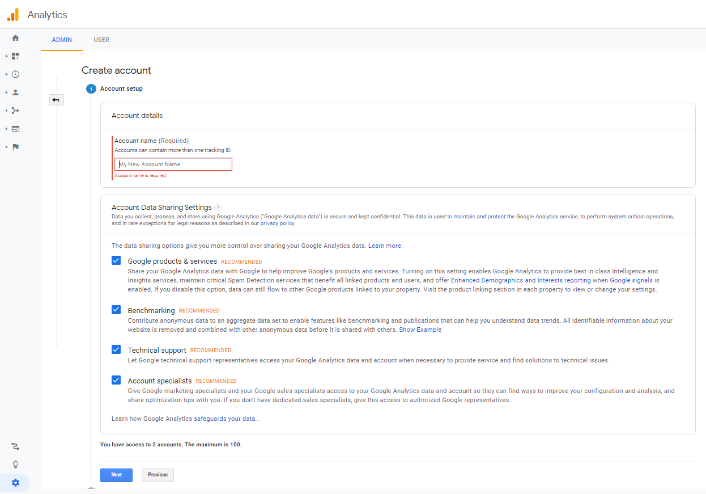
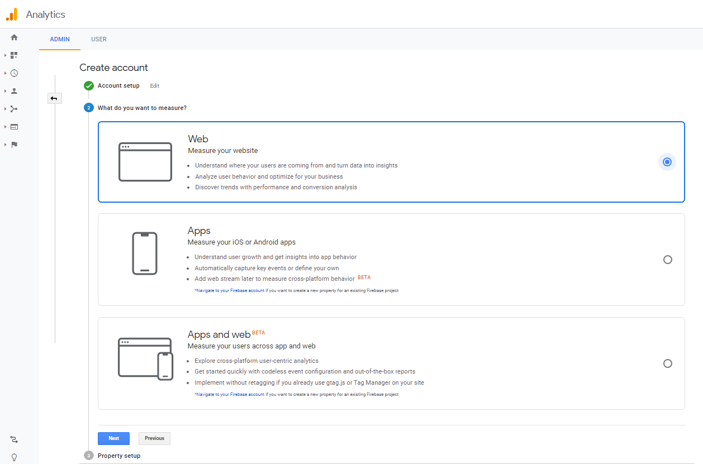
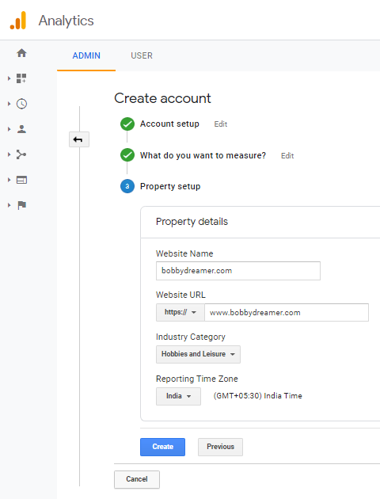
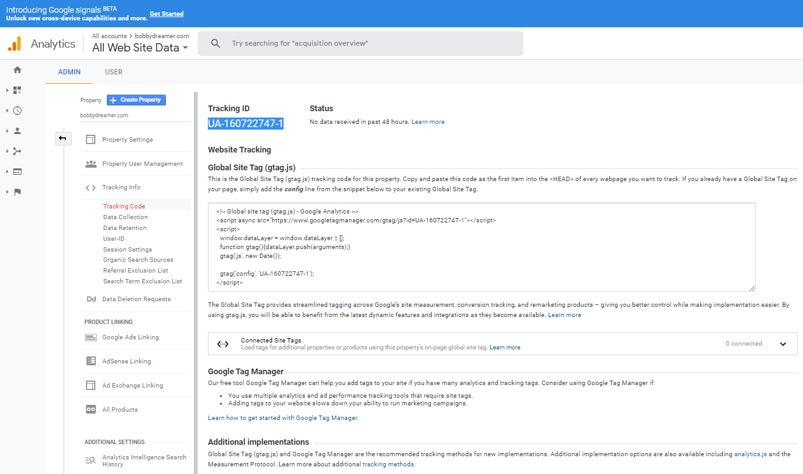
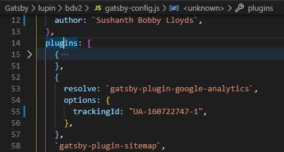

### Steps to setup Google Analytics

1. Go to [Google Analytics](https://analytics.google.com/) website

1. Click "Create account"

1. Enter account name

1. Choose "What do you want to measure ?" Web in my case as it a site. 

1. Enter property details like site name

1. Accept Google Analytics Terms of Service Agreement

1. Tracking ID can be seen on the right side of the screen. It can also be found in     
  `Admin -> Property section -> Tracking Info -> Tracking code`

1. Once you have the Tracking ID, you can add that to `gatsby-config.js` to get the statistics of your site. 

### Resource 
1. [Gatsby - Adding Analytics](https://www.gatsbyjs.org/docs/adding-analytics/)