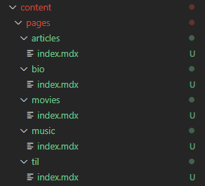
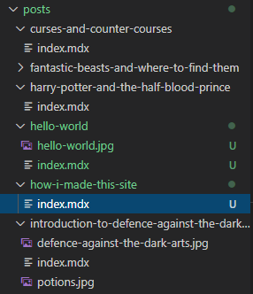
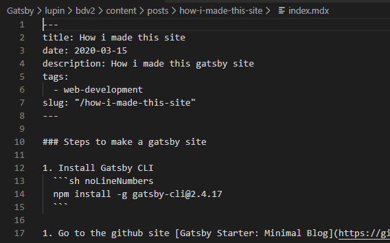

### # Steps to make a gatsby site

1. Install Gatsby CLI
  ```sh noLineNumbers
  npm install -g gatsby-cli@2.4.17
  ```

1. Go to the github site [Gatsby Starter: Minimal Blog](https://github.com/LekoArts/gatsby-starter-minimal-blog)

1. Open your VS Code and create a new folder 
  ```sh noLineNumbers
  mkdir lupin
  cd lupin
  ```

1. Use gatsby CLI to install the starter template. It will take around 5mins or so to finish(in my system)
  ```sh noLineNumbers
  gatsby new bdv2 https://github.com/LekoArts/gatsby-starter-minimal-blog
  ```

1. Start the template site. 
  ```sh noLineNumbers
  cd bdv2 
  gatsby develop
  ```

1. Visit the site `http://localhost:8000/` in browser of your choice. 

After seeing the site working. First change we will be making is in `gatsby-config.js` and i have highlighted the updated portions in the below file
  ```json {7-12,19-38,41-48,55,62-64}
  require(`dotenv`).config({
    path: `.env`,
  })

  module.exports = {
    siteMetadata: {
      siteTitle: `bobby_dreamer`,    
      siteTitleAlt: `BobbyDreamer - Works of Sushanth Bobby Lloyds`,
      siteHeadline: `Personal website of Sushanth Bobby Lloyds`,
      siteUrl: `https://www.bobbydreamer.com`,
      siteDescription: `Sushanth Bobby Lloyds. Programming. Games. Music. Videos. Resume. Experiments.`,
      author: `Sushanth Bobby Lloyds`,
    },
    plugins: [
      {
        resolve: `@lekoarts/gatsby-theme-minimal-blog`,
        options: {
          navigation: [
            {
              title: `bio`,
              slug: `/bio`,
            },          
            {
              title: `articles`,
              slug: `/articles`,
            },
            {
              title: `TIL`,
              slug: `/til`,
            },
            {
              title: `music`,
              slug: `/music`,
            },
            {
              title: `movies`,
              slug: `/movies`,
            },
          ],
          externalLinks: [
            {
              name: `Github`,
              url: `https://github.com/bobbydreamer`,
            },
            {
              name: `LinkedIn`,
              url: `https://www.linkedin.com/in/sushanth-bobby-lloyds/`,
            },
          ],
        },
      },
      {
        resolve: `gatsby-plugin-google-analytics`,
        options: {
          trackingId: process.env.GOOGLE_ANALYTICS_ID,
        },
      },
      `gatsby-plugin-sitemap`,
      {
        resolve: `gatsby-plugin-manifest`,
        options: {
          name: `BobbyDreamer - Works of Sushanth Bobby Lloyds`,
          short_name: `bobby|dreamer`,
          description: `Sushanth Bobby Lloyds. Programming. Games. Music. Videos. Resume. Experiments.`,
          start_url: `/`,
          background_color: `#fff`,
          theme_color: `#6B46C1`,
          display: `standalone`,
          icons: [
            {
              src: `/android-chrome-192x192.png`,
              sizes: `192x192`,
              type: `image/png`,
            },
            {
              src: `/android-chrome-512x512.png`,
              sizes: `512x512`,
              type: `image/png`,
            },
          ],
        },
      },
      `gatsby-plugin-offline`,
      `gatsby-plugin-netlify`,
      // `gatsby-plugin-webpack-bundle-analyser-v2`,
    ],
  }
  ```

#### Changes to home page 
* Updating the main banner text called the "Hero" text   
  To edit the hero text ("Hi, I'm Lupin...), create a file at `src/@lekoarts/gatsby-theme-minimal-blog/texts/hero.mdx` 
  to edit the text.
    ```MD:title=hero.mdx
    <h3>Hello, I'am Sushanth.</h3>

    I am a mainframe Db2 DBA. 

    Yep, mainframe is still there and as usual its highly scalable, highly available and highly secured. 
    Occasionally, Tom Cruise tries to visit us from ceiling, we just look up and say "Hi Tom" and he just panics and says "Code red, mission compromised" and he does his trailer-shot run. :D

    This site is my sandbox, probably will contain collection of my unorganized notes/articles, programming tests, home projects, fav. music, fav. YT videos and VLC screenshots not sure why i take those, mostly stuff i took time to look at.
    ```

* Updating the "Projects" part which is below the "Latest Posts" in the home page   
  Create a file at `src/@lekoarts/gatsby-theme-minimal-blog/texts/bottom.mdx` to edit the contents.
    ```MD:title=bottom.mdx 
    <Title text="Home Projects" />

    - [Stash](http://stash.bobbydreamer.com)
    - [Feedback Management System](https://feedbacks.bobbydreamer.com/)
    ```

#### Adding content  

##### Adding new page
New page insense like, its an isolated page which needs to be in the top header-menu. For this site, i have decided 
to have below pages, 
+ **bio** - Possibly going to be a long resume
+ **blog** - I have no intention of creating something like article as most of the content is going to be a How-to, Step-by-step and 
if its NON-IT, just few words on why i took time to post about it. So, subsections of this page going to be 
    + Notes - I take notes when i am learning something, if i don't have something elaborate, i am going to put that in notes section.
    + Cheatsheet - This is going to like quick commands to get things done. A quickie. 
    + Article - Notes & Cheatsheet will eventually evolve into this. 
+ **TIL**(Today i learned) - Snippets, life lessons, plans, ideas, todos, bucket list, etc. 
+ **music** - Playlist of favourite songs. Why Youtube has this weird issue, if a song video is deleted, in your playlist it shows as deleted video, but don't know what got deleted to add that back. So here i am going to put that list. 
+ **movies** - I used to be a Movie freak, this section will have list of movies i have watched and few sentences on why i like it. 


**Steps to add new page**   

1. Create a new folder inside `content/pages`

1. Create a new `index.mdx` file
    

1. In `index.mdx` write your frontmatter(title, slug) and content
    

1. Optionally add files/images to the folder you want to reference from the page  

1. Go and update `gatsby-config.js --> navigation`  
  ```js noLineNumbers
      navigation: [
        {
          title: `bio`,
          slug: `/bio`,
        },          
        {
          title: `music`,
          slug: `/music`,
        },
      ],
  ```

##### Adding new post

Posts are something that we create or update regularly, this does not come in header menu. Posts appear in section 
"Latest Posts" in home page(only latest 3 are shown, no options to increase that)

Posts can be created/added by creating MDX files inside `content/posts` folder.

**Steps to add new page**   

1. Create a new folder inside `content/posts`

1. Create a new `index.mdx` file
  

1. In `index.mdx` write your frontmatter(title, date, description, tags and slug) and content below it
  

1. Optionally add files/images to the folder you want to reference from the page

### # Advantages / Disadvantages of this theme
**Advantages**    

1. Code block - You can highlight specific code lines in a code block, turn on/off line numbers, can mention programming language name and title
1. Blog page will be updated with the list of all the posts in descending order. If post doesn't appear, basically means that .mdx file has issues. Check the VSCode console for any error messages. 
1. Has Dark mode
1. Tagging
1. Images get optimized properly and images have shadow glowing effect

**Disadvantages**    

1. [Gatsby Markdown MDX](https://www.gatsbyjs.org/docs/mdx/markdown-syntax/) - Not all markdown features works like markdown supports html inbetween markdown codes. 
Here there is no line breaks `<br>`
1. Making custom changes to the code, you have to be an expert going through codes in ```node_modules``` folder and sub-folders. 
  ```sh 
  @lekoarts\gatsby-theme-minimal-blog-core
  @lekoarts\gatsby-theme-minimal-blog
  ```

**Custom Changes**    

Some of the custom changes, i had made to site are, 

1. To increase number of posts displayed in homepage from default 3. Check the below file, 
  ```sh
  lupin\bdv2\node_modules\@lekoarts\gatsby-theme-minimal-blog-core\src\templates\homepage-query.tsx
  ```
1. Spacing updates ( thought there were big gap between content & texts )
    + Blog post : Increasing space between H4 and previous element    
      Updated ```lupin\bdv2\node_modules\@lekoarts\gatsby-theme-minimal-blog\src\gatsby-plugin-theme-ui\index.js``` - Added ```mt: 4```    

      ```js
        h4: {
          ...tailwind.styles.h4,
          color: `heading`,
          fontSize: [2, 3, 4],
          mt: 4,
        },
      ```    

    + Home page : Reducing the space between Latest posts and Home projects    
    ```lupin\bdv2\node_modules\@lekoarts\gatsby-theme-minimal-blog\src\components\listing.tsx```

      ```js
      From = <section sx={{ mb: [5, 6, 7] }} className={className}>
      To   = <section sx={{ mb: [3, 4, 5] }} className={className}>
      ```    
      
    + Home page : Enabling tags in Latest posts    
    ```lupin\bdv2\node_modules\@lekoarts\gatsby-theme-minimal-blog\src\components\homepage.tsx```

      ```js
      From = <Listing posts={posts} showTags={false} />
      To   = <Listing posts={posts} showTags={true} />
      ```    
      
    + Home page : More space between multiple sections in the bottom    
    ```lupin\bdv2\node_modules\@lekoarts\gatsby-theme-minimal-blog\src\components\list.tsx```

      ```js
      #FROM 
            ul: { margin: 0, padding: 0},
            li: { listStyle: `none`, mb: 3 },

      #TO
            ul: { margin: 0, padding: 0, mb: 4 },
            li: { listStyle: `none`, mb: 2 },
      ```    

    + Blog page : Reducing the space between Header and Blog title    
      Updated ```lupin\bdv2\node_modules\@lekoarts\gatsby-theme-minimal-blog\src\components\header.tsx``` 

      ```js
      From = <header sx={{ mb: [5, 6] }}>
      To   = <header sx={{ mb: [4, 5] }}>
      ```    

    + Blog page : Updated space between "Blog" title and list items    
      Updated ```lupin\bdv2\node_modules\@lekoarts\gatsby-theme-minimal-blog\src\components\blog.tsx```

      ```js 
      From : <Listing posts={posts} sx={{ mt: [4, 5] }} />
      To   : <Listing posts={posts} sx={{ mt: [3, 4] }} />
      ```    

1. Adding 404 page


 **Does it fit the purpose ?**    
Yes. I wanted a simple blog site, wanted it to fast, responsive with tagging capabilities for posts

Now please go and try it for yourself.    

**Thanks**!

